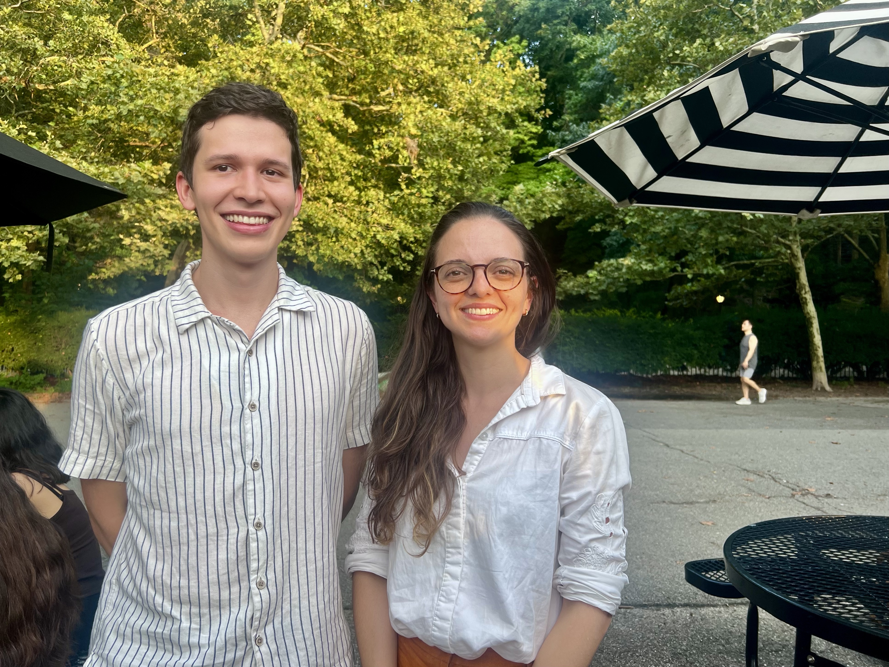

August 2026 - Santiago Perez Ospina started his Ph.D. through the CUNY-NYBG joint program. Santiago obtained his bachelor in Science from the Universidad de Antioquia, Colombia. He is very passionate about plant evodevo!

Stayed tuned for all his updates!

{fig-align="center"}

