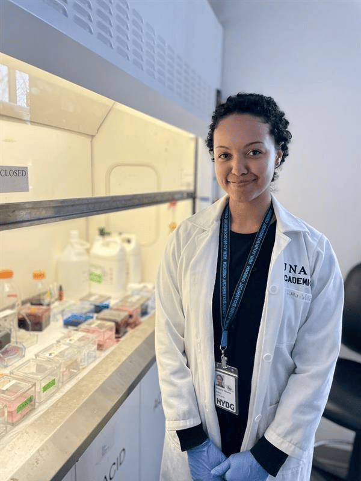

## Principal Investigator

### Cecilia Zumajo-Cardona

*Principal Investigator*

Welcome to the Zumajo-Cardona Lab at NYBG!

I am an Assistant Curator at NYBG working on Evo-Devo of seed plants.

For my research I use classical morpho-anatomical approaches, with up to date tools that can be implemented in non model species mostly.

I use different programming languages such as Bash, AWK and Python, that are of great help for analyzing the transcriptome data.

Do not hesitate to contact me,

Assistant curator at the Laboratory for Integrative Biodiversity Research.

The New York Botanical Garden

czumajo\@nybg.org

{width="300px" fig-align="center"}

------------------------------------------------------------------------

## Lab Members

### Emma Luther 

*NYU Master student*

Emma is... 
{width="300px" fig-align="center"}

------------------------------------------------------------------------

### Yihe Yu

*NYU Master student*

For her Masters' in Biology (with emphasis in computational biology) Yihe is studying the molecular toolkit involved in the flower development of Chloranthus, by analyzing published and our own generated transcriptomes. Her project also takes advantage of the genomes available for this plant family to dive deep in the molecular regulations behind floral reductions. 
{width="300px" fig-align="center"}

------------------------------------------------------------------------

### Ormary Alvarez

*SciNet Intern*

Ormary is our senior intern, she knows a varity of laboratory techniques, and is helping us in the development of serveral projects, including Wollemia seed development and also to digitize our NYBG Seed colection!

{width="300px" fig-align="center"}

------------------------------------------------------------------------

### Lyla Quim

*SciNet Intern*

Lyla is a High School student (Bronx High School of Science) and a SciNet intern who is leading our project on the Chloranthus flower development

{width="300px" fig-align="center"}

------------------------------------------------------------------------
